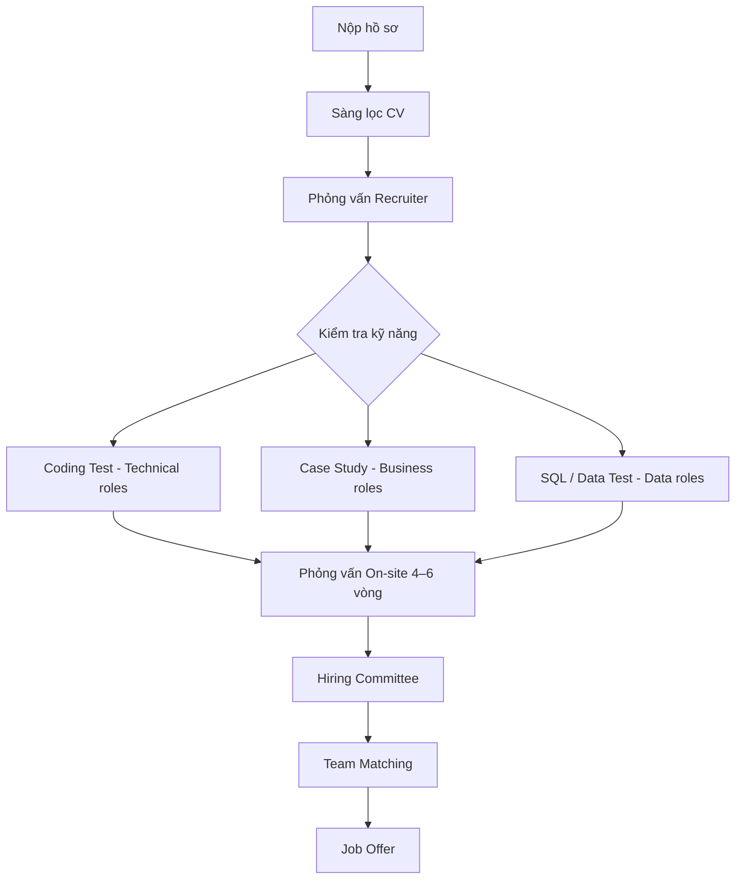

# dental_clinic
```
dental_crm/
│
├─ config/
│   ├─ config.php          # Cấu hình hệ thống (BASE_URL, roles, site name)
│   └─ database.php        # Kết nối MySQL
│
├─ functions/
│   └─ auth_functions.php  # Hàm đăng nhập, kiểm tra role
│
├─ public/
│   ├─ index.php           # Trang chủ (dùng chung)
│   ├─ login.php           # Login Admin/Doctor
│   ├─ logout.php
│   └─ assets/
│       ├─ css/style.css
│       └─ js/script.js
│
├─ admin/
│   ├─ dashboard.php       # Dashboard + thống kê
│   ├─ users.php           # Quản lý bác sĩ
│   ├─ patients.php        # Quản lý bệnh nhân (dữ liệu từ form đặt lịch)
│   ├─ services.php        # Quản lý dịch vụ
│   ├─ appointments.php    # Quản lý tất cả lịch hẹn
│   └─ payments.php        # Quản lý thanh toán
│
├─ doctor/
│   ├─ dashboard.php       # Dashboard bác sĩ
│   ├─ appointments.php    # Xem lịch hẹn hôm nay/tuần
│   └─ patients.php        # Xem/hồ sơ bệnh nhân
│
└─ patient/
    ├─ appointment.php     # Đặt lịch hẹn (không login)
    └─ services.php        # Xem dịch vụ phòng khám
```
```
/dental_clinic/
│
├── index.php                       → Trang khởi đầu (điều hướng theo vai trò)
│
├── config/
│   ├── config.php                   → Cấu hình chung (URL, timezone, constants)
│   └── database.php                 → Kết nối cơ sở dữ liệu MySQL
│
├── auth/
│   ├── login.php                    → Đăng nhập
│   ├── register.php                 → Đăng ký
│   ├── logout.php                   → Đăng xuất
│   └── forgot_password.php          → Quên mật khẩu
│
├── modules/
│   ├── admin/
│   │   ├── dashboard.php            → Trang chính quản trị
│   │   ├── manage_doctors.php       → Quản lý bác sĩ (CRUD)
│   │   ├── manage_users.php         → Quản lý tài khoản người dùng
│   │   ├── manage_appointments.php  → Quản lý lịch hẹn
│   │   ├── manage_services.php      → Quản lý dịch vụ nha khoa
│   │   └── reports.php              → Báo cáo, thống kê
│   │
│   ├── doctor/
│   │   ├── dashboard.php            → Trang chính của bác sĩ
│   │   ├── appointments.php         → Xem lịch khám
│   │   ├── patient_records.php      → Quản lý hồ sơ bệnh nhân
│   │   ├── prescriptions.php        → Đơn thuốc
│   │   └── profile.php              → Hồ sơ cá nhân
│   │
│   └── user/
│       ├── home.php                 → Trang chủ người dùng
│       ├── book_appointment.php     → Đặt lịch hẹn
│       ├── my_appointments.php      → Lịch hẹn của tôi
│       ├── services.php             → Danh sách dịch vụ
│       └── profile.php              → Thông tin cá nhân
│
├── functions/
│   ├── db_functions.php             → Hàm kết nối / truy vấn cơ bản
│   ├── auth_functions.php           → Xử lý đăng ký, đăng nhập, phân quyền
│   ├── user_functions.php           → Xử lý người dùng (sửa thông tin, đổi MK)
│   ├── admin_functions.php          → Quản lý bác sĩ, người dùng, dịch vụ
│   ├── doctor_functions.php         → Xử lý lịch khám, hồ sơ, đơn thuốc
│   └── appointment_functions.php    → Đặt, hủy, xem lịch hẹn
│
├── includes/
│   ├── header.php                   → Thanh điều hướng, logo
│   ├── footer.php                   → Chân trang
│   ├── navbar_admin.php             → Menu riêng cho Admin
│   ├── navbar_doctor.php            → Menu riêng cho Bác sĩ
│   └── navbar_user.php              → Menu riêng cho Người dùng
│
├── assets/
│   ├── css/
│   │   ├── style.css
│   │   ├── admin.css
│   │   ├── doctor.css
│   │   └── user.css
│   ├── js/
│   │   ├── main.js
│   │   └── validation.js
│   └── images/
│       ├── logo.png
│       └── backgrounds/
│
├── uploads/
│   ├── patient_records/             → Lưu hồ sơ bệnh nhân
│   └── prescriptions/               → Lưu file đơn thuốc
│
└── docs/
    ├── readme.txt                   → Mô tả dự án & hướng dẫn chạy
    └── database.sql                 → File tạo cơ sở dữ liệu
```
